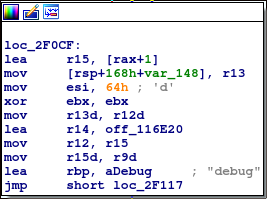
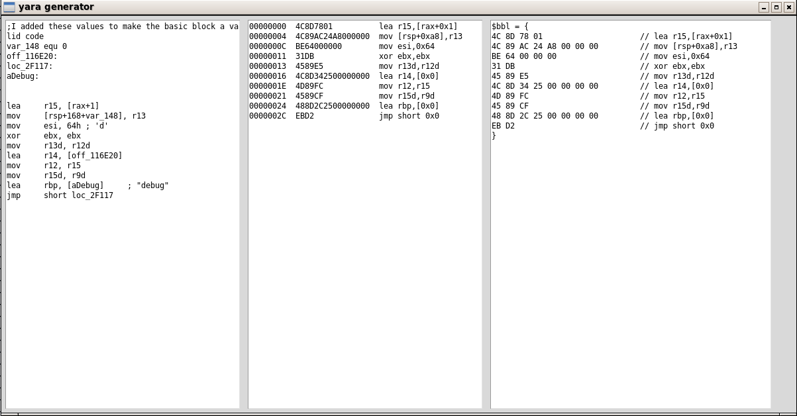
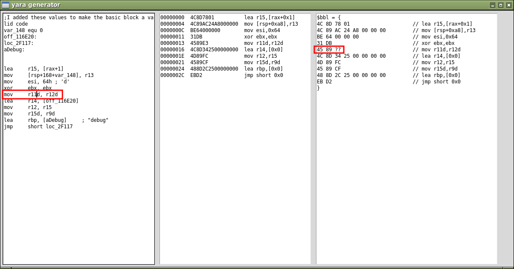

# YaraRulesGenerator
Generate Yara rules from basic blocks


# Example

Generate a yara rule from a basic block:



Run the script:

```bash
./box.py
```

Copy the assembly in the left panel. You may have to slightly adapt the code to make it buildeable:



Making slight changes in the code will change rule pattern



By playing around with values, you will find a rule matching the sample:

```python
rule myrule {
    strings:
    $bbl = {
4C 8D 78 01                     // lea r15,[rax+0x1]
4C 89 6C 24 ??                  // mov [rsp+0x10],r13
BE 64 00 00 00                  // mov esi,0x64
31 DB                           // xor ebx,ebx
45 89 E5                        // mov r11d,r12d
4C 8D ?? ?? ?? ?? ??         // lea r14,[0xfffffff]
4D 89 FC                        // mov r12,r15
45 89 CF                        // mov r15d,r9d
}
  condition:
    $bbl
}
```

Gotcha:

```bash
yara -r a.yara /usr 2>/dev/null
myrule /usr/bin/bash
```


# TODO

ctrl + Z
